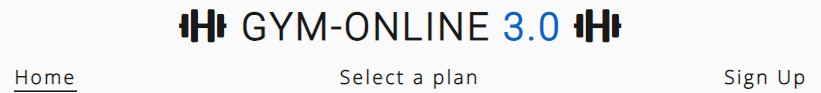
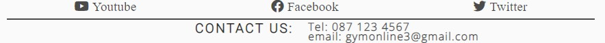
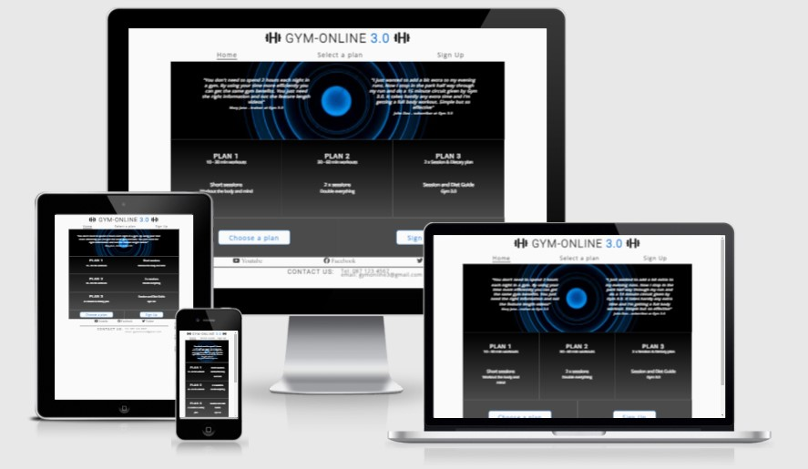
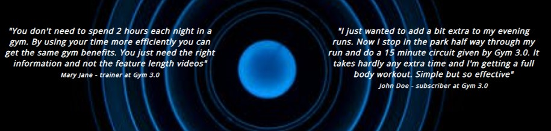
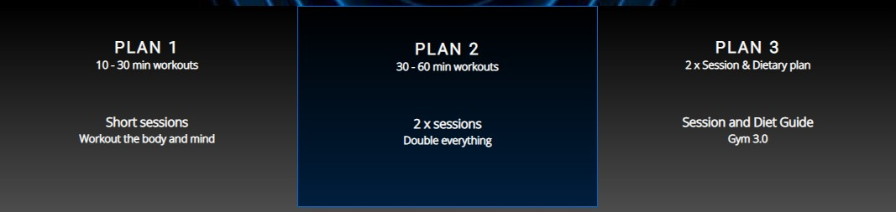
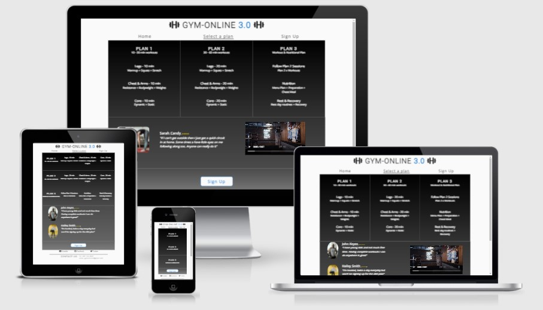
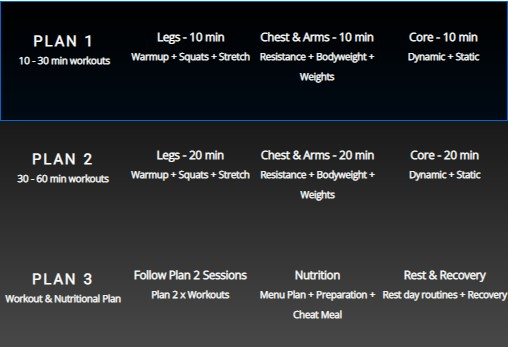
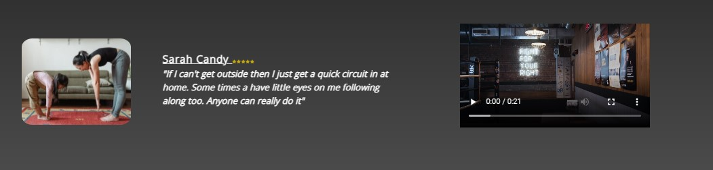
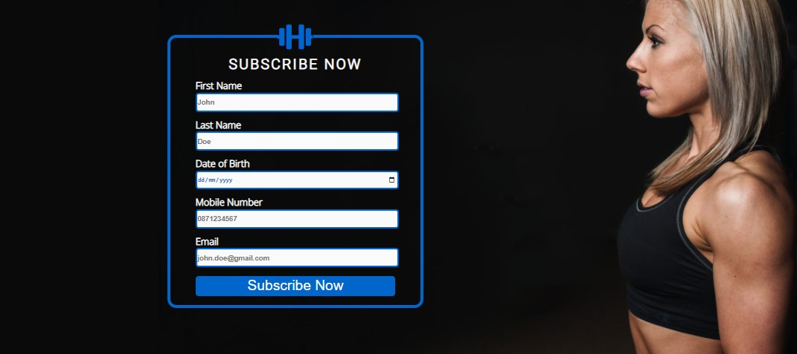
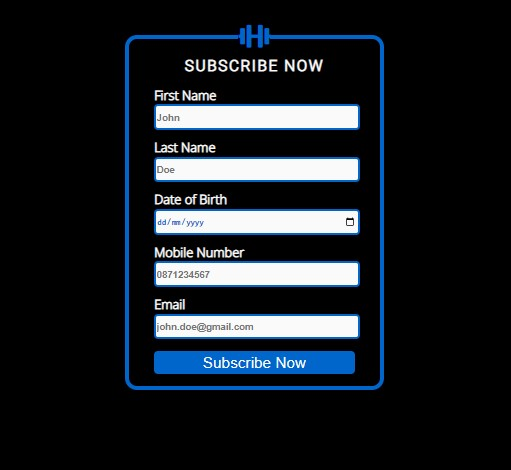

<h1 align="center">Gym Online 3.0</h1>
A website to subscribe to an online gym. Created as part of the Code Institue Portfolio 1: HTML and CSS Essentials Milestone Project.

[Gym Online 3.0 Live Website](https://juliandunne1234.github.io/gym-online-3.0/)

***

***

## Introduction
Nowadays people have access to so much information that filtering this information can be quite time consuming. Online media platforms are great but sometimes you have to watch the entire video to decide if the content is actually what you want. 

Finding 1-2 hours a day to go to a gym is not possible or even appealing to everyone. Anyone that has an interest in physical activity, whether that is 10-30 minutes or longer should have immediate access to a workout plan that will suit their requirements.  

This gym concept is suitable for everyone. From the beginner doing their first pushup to the more advanced user. It can be done at home or in the park, all you need is the ground beneath your feet. The use of actual equipment is optional as there is always a substitute readily available.
***

## Table of Contents
* Features
***

## Features
***

### Header & Navigation
* In the header the "Gym Online 3.0" anchor tag is featured at the top of the page and can be selected from any page to return to the home page.
* There is also a navigation menu in the header of each website page. It includes Home, Select a Plan and a Sign Up options. An active underline is used to display the current page.

***

### Footer & Contact Details
* Social media accounts have not been created. The social media icons displayed in the footer are for aesthetic reasons and include links to website homepages only.
* Contact details for the online gym including email and phone number have also been included for aesthetic purposes only.

***

### Homepage

* Fictional reviews for the online gym are displayed on top of a hero image. The primary reason for the hero image is to show the color profile used throughout the website. On smaller screen sizes only one review is displayed and the other is hidden.

* The online gym offers three different training plans. The homepage subscriber plan section provides high level overview of what each plan includes. Gradient background colors consistent with website are visible and on smaller screen sizes each plan is changed to stacking format instead of side by side.

* Anchor elements styled as buttons are used for navigation purposes to get to the Select a Plan and Sign Up pages. A hover color effect has been implemented. On smaller screen sizes the anchor styled buttons are changed to a stacking format instead of side by side.

***

## Select a Plan

* Similiar to the homepage the select-a-plan page contains three training plans. The subscriber plan detail section provides lower level information on what each training plan entails. The same layout as the homepage is used with gradient background colors.
 

* On smaller screen sizes each plan is changed to stacking format instead of side by side.
 

* Additional subscriber reviews section including images of fictional subscribers working out at home and a video showing a person walking through an old gym door is for motivational purposes. Layout changes as screen sizes reduce where the video is hidden and the subscriber reviews and images change.

* Anchor elements styled as a button used for navigation purpose to get to the Sign Up page. A hover color effect has been implemented.

***

### Sign Up

* The Sign Up page includes a subscription form that interested subscribers to the online gym can complete. Each input box is required to be complete before the Subscribe Now button to submit the data can be select without generating a fill in empty fields warning.
* The background image includes an athletic looking person. At larger image sizes an additional background coloring has been added to extend the background image. This is to reduce automatic image resizing.

* On smaller screen sizes only a background color is used with the subription form displayed.

***